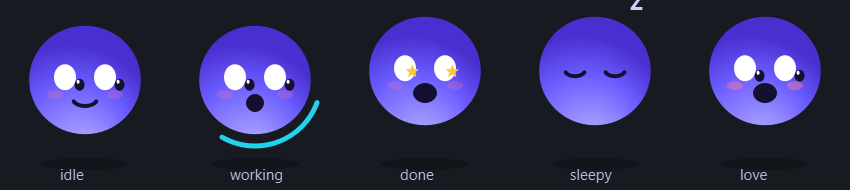

# K球 · Kimi 桌面宠物

> 一只住在屏幕角落的 Kimi 小球：会呼吸、会眨眼、会盯着你的鼠标看，任务完成时跳起来撒花庆祝。



## 状态

| 状态 | 表现 | 触发 |
|---|---|---|
| `idle` | 呼吸起伏 + 随机眨眼 + 鼠标注视 | 默认 |
| `working` | 转圈思考 + o 嘴 | API |
| `done` | **星星眼 + 跳跃 + 彩带 + 提示音** | API / 任务完成 |
| `sleepy` | 闭眼 + Zzz 飘字 | API |
| `love` | 腮红加重 + 爱心音 | 点击摸头（按住） |

## 运行

```bash
pip install PySide6
python kqiu.py
```

无边框、透明背景、置顶显示，左键按住可拖动，点它一下它会开心。

## HTTP 控制接口（127.0.0.1:28765）

```
GET /state?to=idle|working|done|sleepy|love   # 切换状态
GET /sound?play=done|click|love|work          # 只播音效
```

任何脚本都能触发"任务完成庆祝"，例如 curl：

```bash
curl "http://127.0.0.1:28765/state?to=done"
```

## 开发方式（vibecoding 声明）

本项目由人类提出创意与审美方向、AI（Kimi Code）完成全部代码实现——矢量绘制、动画状态机、粒子彩带、音效编排、HTTP 接口，零素材依赖，单文件交付。

## License

MIT
