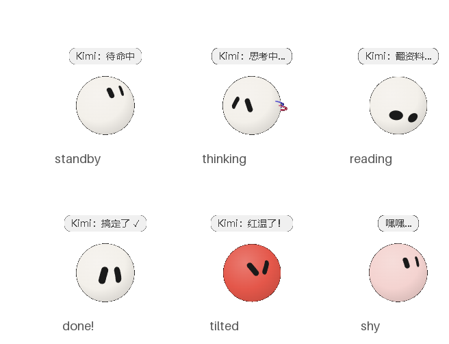

# KimiQ · Kimi 桌面宠物

> 一只住在你屏幕角落的白色小球，和 Kimi Code 实时连通：
> Kimi 思考、翻资料、干活、出错、红温、完成撒花……它都演给你看。



**表情设计完全来自开源项目 [sam70361/emotion-ball](https://github.com/sam70361/emotion-ball)**（32 套表情+渲染引擎原样复用，不重绘不改色），KimiQ 给它套了桌面宠物的壳，并接入了 Kimi Code 的实时状态。

---

## 给人看的手册

### 它会什么

- **状态联动**：Kimi 收到任务 / 思考 / 联网 / 翻资料 / 干活 / 写回复 / 完成撒花 / 出错 / 等你输入——每个状态都有专属表情，气泡同步显示"Kimi 正在干什么"（读哪个文件、跑什么命令、任务第几条）
- **有内心戏**：思考久了会走神（专注/好奇/困惑随机换脸）；连续翻车会红温（出错 → 慌张 → 生气）；连续工作 30 分钟会累
- **待命自己玩**：空闲太久会自言自语、自己甩彩带、关心主人（"喝口水休息下吧"）
- **能撸**：拖拽移动、按住摸头会害羞、双击满意撒花、单击彩带、拖到屏幕边缘自动贴边隐藏、悬停探出
- **子代理小球**：Kimi 派出子代理时，头顶会坐一只迷你球陪跑（最多 2 只）
- **气泡可调**：自动浮现 / 常驻状态栏 / 仅悬停 / 关闭；贴球顶 / 靠球旁；详细状态开关——右键球即调
- 单实例锁、位置记忆、勿扰模式（右键勾选，球睡觉+全静默）、开机自启、开球时自动拉起 Kimi CLI、Kimi 会话启动时自动拉起球

### 快速开始

**方式一：exe（推荐，无需 Python）**
1. Releases 页下载 `KimiQ.exe`，双击运行
2. 首次启动后它会自动把 hooks 转发器装到 `%APPDATA%\KimiQ\hooks\`
3. 把 hooks 配进 Kimi Code（见下节，或者直接丢给 AI 装）

**方式二：源码**

```bash
pip install PySide6
python kimiq.py            # 正常运行
python kimiq.py --gallery  # 图鉴模式：32 套表情自动巡演
```

### 接入 Kimi（状态联动的关键）

球本身只是演员，状态全靠 Kimi Code 的 hooks 喂。最省事的接法：**把这个仓库发给 Kimi，说"帮我装 KimiQ"**，它会照下面的 AI 手册帮你配好。

手动接法：把「AI 安装手册」第 3 步的 15 条 `[[hooks]]` 追加到 `~/.kimi-code/config.toml`，新开 Kimi 会话（或 `/reload`）生效。

### 互动速查

| 操作 | 效果 |
|---|---|
| 拖拽 | 移动位置；拖到屏幕左右边缘松手 → 贴边隐藏 |
| 按住不动 | 摸头 → 害羞；松开回待机 |
| 单击 | 甩一圈彩带 |
| 双击 | 满意彩蛋 |
| 悬停 | 气泡显示 Kimi 当前状态 |
| 右键 | 设置 / 气泡 / 图鉴 / 勿扰 / 退出 |
| 睡着时碰它 | 抖动惊醒 |

---

## AI 安装手册（写给 Kimi Code 等 AI 助手，人类可跳过）

> 用户把这个仓库丢给你，是想让你**帮他把 KimiQ 装好并跑起来**。照做即可，全是实测过的步骤。

### 0. 架构一句话

PySide6 透明窗体壳（`kimiq.py`）内嵌 `harness.html`（加载 `vendor/emotion-ball/` 引擎）→ 本地 HTTP `127.0.0.1:28765` ← Kimi Code 的 `[[hooks]]` 经 `hooks/kimiq-hook.mjs`（node）curl 转发事件。hooks 只发、桌宠只演，fail-open 解耦。

### 1. 把桌宠跑起来（二选一）

- 有 exe：直接启动 `dist\KimiQ.exe`（或 Releases 下载的）
- 源码：`pip install PySide6` 后 `pythonw kimiq.py`

验证：`curl http://127.0.0.1:28765/state?to=33` 应返回 `{"ok":true}`，且桌上的球撒花。

**桌宠每次启动会自动做三件自愈的事**（所以顺序必须是先跑桌宠再配 hooks）：
1. 写 `%APPDATA%\KimiQ\home.json`（本体位置登记，autostart 靠它）
2. 把转发器装到 `%APPDATA%\KimiQ\hooks\kimiq-hook.mjs`（**稳定路径**）
3. 若 `~/.kimi-code/config.toml` 里已有旧转发器路径，自动修指向稳定副本

### 2. 配 hooks（关键）

把下面 15 条**原样**追加到 `~/.kimi-code/config.toml`（Windows 在 `C:\Users\<用户>\.kimi-code\config.toml`），把 `<APPDATA>` 换成用户实际路径（如 `C:/Users/xxx/AppData/Roaming`，用正斜杠）：

```toml
[[hooks]]   # 用户提交 → 31 接收任务
event = "UserPromptSubmit"
command = "node <APPDATA>/KimiQ/hooks/kimiq-hook.mjs 31"
timeout = 5

[[hooks]]   # 回合开始 → 30 思考中
event = "TurnStarted"
command = "node <APPDATA>/KimiQ/hooks/kimiq-hook.mjs 30"
timeout = 5

[[hooks]]   # 写计划 → 30 思考中（带任务条详情）
event = "PreToolUse"
matcher = "^TodoList$"
command = "node <APPDATA>/KimiQ/hooks/kimiq-hook.mjs 30 --detail"
timeout = 5

[[hooks]]   # 联网搜索/读网页 → 36 联网加载（带搜索词）
event = "PreToolUse"
matcher = "^(WebSearch|FetchURL)$"
command = "node <APPDATA>/KimiQ/hooks/kimiq-hook.mjs 36 --detail"
timeout = 5

[[hooks]]   # 读文件/检索代码 → 40 检索资料（带文件名）
event = "PreToolUse"
matcher = "^(Read|Grep|Glob|TaskList|TaskOutput)$"
command = "node <APPDATA>/KimiQ/hooks/kimiq-hook.mjs 40 --detail"
timeout = 5

[[hooks]]   # 执行类工具 → 32 处理中忙碌（带命令/文件名）
event = "PreToolUse"
matcher = "^(Bash|Edit|Write|Agent|AgentSwarm|CronCreate|CronDelete|TaskStop|Skill)$"
command = "node <APPDATA>/KimiQ/hooks/kimiq-hook.mjs 32 --detail"
timeout = 5

[[hooks]]   # 工具失败 → 34 出错（连续失败自动升级 17 慌张 → 21 红温）
event = "PostToolUseFailure"
command = "node <APPDATA>/KimiQ/hooks/kimiq-hook.mjs 34"
timeout = 5

[[hooks]]   # 回合失败 → 34 出错
event = "StopFailure"
command = "node <APPDATA>/KimiQ/hooks/kimiq-hook.mjs 34"
timeout = 5

[[hooks]]   # 等用户审批 → 35 等待输入
event = "PermissionRequest"
command = "node <APPDATA>/KimiQ/hooks/kimiq-hook.mjs 35"
timeout = 5

[[hooks]]   # 审批完成：拒绝 → 38；通过 → 32（转发器读 stdin 自判）
event = "PermissionResult"
command = "node <APPDATA>/KimiQ/hooks/kimiq-hook.mjs perm"
timeout = 5

[[hooks]]   # 回合结束：先 39 输出回复，2 秒后 → 33 任务完成（彩带+音效）
event = "Stop"
command = "node <APPDATA>/KimiQ/hooks/kimiq-hook.mjs 39 --then 33 --delay 2000"
timeout = 8

[[hooks]]   # 用户中途打断 → 41 停止终止
event = "Interrupt"
command = "node <APPDATA>/KimiQ/hooks/kimiq-hook.mjs 41"
timeout = 5

[[hooks]]   # 子代理启动 → 召唤小球陪跑
event = "SubagentStart"
command = "node <APPDATA>/KimiQ/hooks/kimiq-hook.mjs baby add"
timeout = 5

[[hooks]]   # 子代理结束 → 收回小球
event = "SubagentStop"
command = "node <APPDATA>/KimiQ/hooks/kimiq-hook.mjs baby remove"
timeout = 5

[[hooks]]   # Kimi 会话启动 → 桌宠没在跑就自动拉起
event = "SessionStart"
command = "node <APPDATA>/KimiQ/hooks/kimiq-hook.mjs autostart"
timeout = 8
```

### 3. 生效与验证

- hooks 是**会话启动时的快照**：改完 config.toml 必须 `/reload`（CLI ≥0.37.2）或重开会话才生效
- 验证：新会话里随便发个指令，球应 31→30→（工具状态）→39→33 走一遍
- 排障：`kimi doctor` 可查 hooks 是否被忽略

### 4. 必读坑位（都是血泪）

- **一个非法事件名 → 整段 `[[hooks]]` 被静默忽略**（日志只有 WARN）。事件名以官方文档 customization/hooks 页为准；`TurnStarted` 需 CLI ≥0.32.0
- hooks 快照机制：转发器路径变了，当前会话仍指旧路径且静默失败——`/reload` 解决
- 转发器命令务必指到 `%APPDATA%` 稳定副本，不要指仓库里的源码（仓库一搬家就断联）
- Windows only（winsound 音效 / 注册表自启 / setMask 点击穿透）
- GPU 坏的机器上 QtWebEngine 可能整窗透明：代码已内置 `--use-angle=swiftshader` 软件渲染兜底
- 截图工具注意：BitBlt/ImageGrab 抓不到硬件加速分层窗口，用 PrintWindow（见 `tools/make_shots.py`）

### 5. HTTP 控制接口（127.0.0.1:28765）

```
GET /state?to=33                 # 切表情：数字 id 或语义名（think/web/read/exec/done/error…）
GET /state?to=40&text=读 app.py  # 带详情：气泡显示"翻资料 · 读 app.py"（详细开关开着时）
GET /sound?play=done             # 只播音效（done/click/love/work）
GET /baby?op=add|remove          # 子代理小球
```

### 6. 表情 id 速查（32 套）

- 生命周期：`00` 睡眠 `01` 唤醒 `02` 待机 `03` 好奇 `04` 发呆 `05` 加载苏醒 `06` 休眠 `07` 抖动唤醒
- 情绪：`10` 开心 `11` 疑惑 `12` 失落 `13` 惊讶 `14` 害羞 `15` 疲惫 `16` 专注 `17` 慌张 `18` 无奈 `19` 满意 `20` 困惑 `21` 生气
- 工作态：`30` 思考 `31` 接收任务 `32` 忙碌 `33` 完成 `34` 出错 `35` 等待输入 `36` 联网 `37` 回忆 `38` 拒绝 `39` 输出 `40` 检索 `41` 停止

### 7. 打包 exe（可选）

```bash
python -m PyInstaller KimiQ.spec   # 产物在 dist/KimiQ.exe（已含图标/引擎/转发器）
```

---

## 版权与致谢

- **32 套表情与渲染引擎 100% 来自 [sam70361/emotion-ball](https://github.com/sam70361/emotion-ball)**，按「不重绘、不改色」原则原样 vendor 在 `vendor/emotion-ball/`，采用作者的《仅供学习交流许可（禁止商业用途）》，LICENSE 原文随包保留。**任何包含该引擎/表情的衍生作品整体须遵守非商业许可**。详见 [ATTRIBUTION.md](ATTRIBUTION.md)
- KimiQ 自有代码（桌宠壳/状态导演/hooks 转发器等）以 MIT 发布，见 [LICENSE](LICENSE)
- KimiQ 与 Kimi Code（月之暗面）的关系：粉丝/用户作品，非官方产品

## 开发方式（AI 原生工作流声明）

本项目由人类提出创意、审美与验收标准，AI（Kimi Code）完成全部代码实现：PySide6 透明窗体壳、QWebEngineView 内嵌作者引擎、状态导演（内心戏/红温/自语）、hooks 联动转发、PyInstaller 打包。
